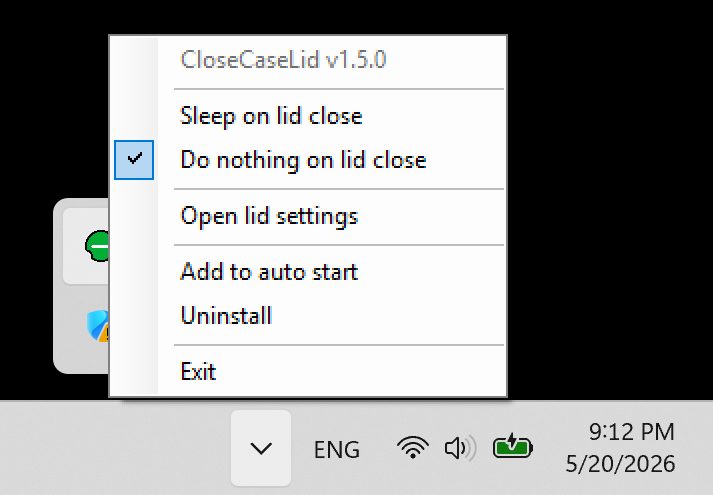

# CloseCaseLid

## What It Does

CloseCaseLid exists for one very specific Windows annoyance: sometimes closing the laptop lid should put the machine to sleep, and sometimes it absolutely should not. Windows normally makes that small decision feel much larger than it needs to be.

This app lives in the system tray and lets you switch lid-close behavior in one click between `Sleep on lid close` and `Do nothing on lid close`. It also provides quick access to the classic lid settings page, startup options, and uninstall.

Latest builds are available on the [GitHub Releases page](https://github.com/limonspb/CloseCaseLid/releases/).

## How To Use

Double-click `CloseCaseLid.exe`.

On first launch, the app copies itself to `%LocalAppData%\CloseCaseLid\CloseCaseLid.exe`, relaunches from there, and continues running from that installed location so startup uses a stable path.

The tray menu includes:

- `Sleep on lid close`
- `Do nothing on lid close`
- `Open lid settings`
- `Add to auto start`
- `Remove from auto start`
- `Uninstall`
- `Exit`

Notes:

- The app updates both plugged-in and battery lid-close actions together.
- `Open lid settings` opens the classic Control Panel page for `Choose what closing the lid does`.
- `Add to auto start` writes the installed `%LocalAppData%` copy into `HKCU\Software\Microsoft\Windows\CurrentVersion\Run`.
- `Remove from auto start` only removes the startup entry and keeps the app running.
- `Uninstall` asks for confirmation, removes the startup entry, deletes the installed `%LocalAppData%` copy, and closes the app.
- If the app is launched from another location later, it refreshes the installed copy in `%LocalAppData%` and relaunches from there.

## How To Build

Two build paths are included.

- `build-framework.bat`
  Builds the .NET Framework version like the included `CloseCaseLid.exe`. The script auto-detects `csc.exe` from common Windows framework locations or from `PATH`.

- `build-self-contained.bat`
  Publishes a true self-contained single-file build when a modern .NET SDK is installed. It uses `dotnet` from `PATH` and does not depend on a hardcoded SDK install path.

Supporting files:

- `CloseCaseLid.csproj`
  Project file used by the self-contained build.

- `icons\convert-user-icons.ps1`
  Regenerates the embedded `.ico` files in `icons` from the PNGs in that same folder before building.
